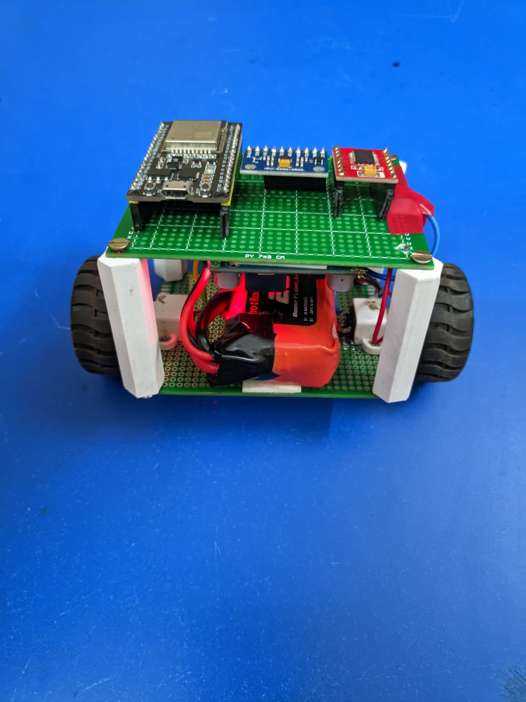

<div align="center">

# 🤖 Self-Balancing Robot

**ESP32 · MPU-9250 · TB6612FNG · Kalman Filter · PID · WebSocket**

An ESP32-based two-wheeled self-balancing robot with real-time PID tuning via a browser interface over WebSocket — no reflashing required during tuning.

---


</div>

---

## 📑 Table of Contents

- [Overview](#-overview)
- [Hardware](#-hardware)
- [Wiring](#-wiring)
- [Software Architecture](#-software-architecture)
- [Kalman Filter](#-kalman-filter)
- [PID Controller](#-pid-controller)
- [Web Tuner Interface](#-web-tuner-interface)
- [Setup & Flashing](#-setup--flashing)
- [Calibration](#-calibration)
- [PID Tuning Guide](#-pid-tuning-guide)
- [Project Structure](#-project-structure)
- [License](#-license)

---

## 🔍 Overview

The robot maintains upright balance by continuously measuring its tilt angle using an MPU-9250 IMU, estimating the true angle using a Kalman filter, and driving two DC motors via a PID control loop. PID gains and the start/stop state are adjustable in real time through a browser-based tuning page over WebSocket.

```
┌─────────────┐     I2C      ┌─────────────┐    PWM     ┌─────────────┐
│  MPU-9250   │ ──────────► │    ESP32    │ ─────────► │  TB6612FNG  │
│  Accel+Gyro │             │  Kalman+PID │            │ Motor Driver│
└─────────────┘             └──────┬──────┘            └─────────────┘
                                   │ WebSocket
                            ┌──────▼──────┐
                            │  Browser UI │
                            │  PID Tuner  │
                            └─────────────┘
```

<!--  -->
---


## 🔧 Hardware

| Component | Part |
|-----------|------|
| Microcontroller | ESP32 (DevKit V1 or equivalent) |
| IMU | MPU-9250 (I2C) |
| Motor Driver | TB6612FNG |
| Motors | N20 / BO DC gear motors (2×) |
| Power | 7.4V 2S LiPo → motors · 3.3V regulated → ESP32 & IMU |

---

## 🔌 Wiring

### MPU-9250 → ESP32

| MPU-9250 | ESP32 |
|----------|-------|
| VCC | 3.3V |
| GND | GND |
| SDA | GPIO 21 |
| SCL | GPIO 22 |
| AD0 | GND (sets I2C address to 0x68) |

### TB6612FNG → ESP32

| TB6612FNG | ESP32 GPIO |
|-----------|-----------|
| AIN1 | 5 |
| AIN2 | 16 |
| PWMA | 4 |
| BIN1 | 18 |
| BIN2 | 19 |
| PWMB | 23 |
| STBY | 3.3V (always enabled) |
| VM | Battery+ |
| VCC | 3.3V |
| GND | GND |

> **Note:** PWMA and PWMB are driven at 20kHz using the ESP32 LEDC peripheral (8-bit resolution).

---

## 🏗 Software Architecture

```
loop() [200Hz]
  │
  ├─ readMPU()          — raw accel + gyro over I2C
  ├─ kalman.update()    — fuse accel angle + gyro rate → clean angle
  ├─ PID compute        — error × Kp + integral × Ki + derivative × Kd
  ├─ setMotors()        — PWM output to TB6612FNG
  └─ wsServer.loop()    — WebSocket clients · telemetry @ 10Hz
```

The main control loop runs at 200Hz. WebSocket and HTTP server handling is interleaved without blocking the control loop — timing is enforced using `micros()` delta checks rather than `delay()`.

---

## 📐 Kalman Filter

A 1D Kalman filter fuses the accelerometer angle (noisy but drift-free) with the gyroscope rate (accurate short-term but drifts over time).

**State vector:** `[angle, gyro_bias]`

**Tunable parameters:**

```cpp
float Q_angle   = 0.001f;   // process noise — angle
float Q_bias    = 0.003f;   // process noise — gyro bias
float R_measure = 0.03f;    // measurement noise
```

> Increase `R_measure` if the angle estimate is jittery. Decrease `Q_angle` if the filter responds too slowly.

**Angle axis:** MPU-9250 is mounted with X forward, Y to the side, Z up. Forward/backward tilt is rotation about Y — computed from X and Z axes:

```cpp
float accelAngle = atan2(ax, az) * 180.0f / PI;
float angle      = kalman.update(accelAngle, gy, dt);
```

---

## 🎛 PID Controller

```
output = Kp × error  +  Ki × ∫error dt  +  Kd × (d error / dt)
```

where `error = angle − setpoint`

Output is clamped to `[−255, 255]` and written directly as PWM duty cycle to both motors.

**Integral windup protection:**

```cpp
const float INTEGRAL_LIMIT = 200.0f;
integral = constrain(integral, -INTEGRAL_LIMIT, INTEGRAL_LIMIT);
```

**Tilt cutoff:** Motors stop if `|angle| > 60°`. The `running` flag is preserved so the robot auto-resumes when picked back up.

**Default gains:**

| Gain | Value | Role |
|------|-------|------|
| Kp | 3.5 | Proportional — main restoring force |
| Ki | 0.05 | Integral — corrects steady lean |
| Kd | 0.4 | Derivative — damps oscillation |
| Setpoint | 0.0° | Target balance angle |

---

## 🌐 Web Tuner Interface

The ESP32 runs two servers simultaneously:

| Server | Port | Purpose |
|--------|------|---------|
| HTTP | 80 | Status page |
| WebSocket | 81 | Bidirectional PID control + telemetry |

### Getting the IP

After flashing, open **Serial Monitor at 115200 baud**. The ESP32 prints its IP on boot:

```
IP: 192.168.x.x
```

Open the tuner page in any browser on the same WiFi network, enter this IP in the connection box, and click **Connect**.

### Features

- 🟢 Live connection status indicator
- 📊 Real-time angle + PID output chart
- 🎚 Sliders with fine step control (Kp: `0.25` · Ki/Kd: `0.025`)
- ✏️ Direct number input — type any value precisely
- ▶️ Start / Stop button

### WebSocket Protocol

**Telemetry from ESP32 → browser (10Hz):**
```json
{"angle": 1.23, "output": 47.0, "kp": 3.50, "ki": 0.050, "kd": 0.400}
```

**Commands from browser → ESP32:**
```json
{"kp": 3.5, "ki": 0.05, "kd": 0.4, "sp": 0.0, "running": true}
```

---

## 🚀 Setup & Flashing

### Prerequisites

- Arduino IDE 2.x with ESP32 board package installed
- Libraries — install via Library Manager:
  - `WebSockets` by Markus Sattler
  - `ArduinoJson` by Benoit Blanchon

### Steps

1. Clone this repo
2. Open `self_balancing_robot.ino` in Arduino IDE
3. Set your WiFi credentials:
```cpp
const char* ssid     = "your_network";
const char* password = "your_password";
```
4. Paste your IMU calibration offsets (see [Calibration](#-calibration))
5. Select board: `ESP32 Dev Module`, select your COM port
6. Flash and open Serial Monitor at **115200 baud**
7. Note the IP address printed on successful connection
8. Open the tuner page in your browser, enter the IP, click Connect

> ⚠️ ESP32 supports **2.4GHz WiFi only**. If your router broadcasts both bands under the same SSID, explicitly connect your device to the 2.4GHz band.

---

## 📏 Calibration

Run `calibration/calibration.ino` separately before flashing the main code. Place the robot **flat and completely still** on a level surface — do not move it during the 2000-sample collection (~4 seconds).

The sketch prints 6 offset values to Serial. Paste them into the main code:

```cpp
const float AX_OFF = 0.0f, AY_OFF = 0.0f, AZ_OFF = 0.0f;
const float GX_OFF = 0.0f, GY_OFF = 0.0f, GZ_OFF = 0.0f;
```

**Sanity check — with offsets applied, flat and still:**

| Axis | Expected |
|------|----------|
| ax | ≈ 0.0 g |
| ay | ≈ 0.0 g |
| az | ≈ 1.0 g |
| gx, gy, gz | ≈ 0.0 °/s |

---

## 🎯 PID Tuning Guide

Follow this order. Do not skip steps.

**Step 1 — Verify motor direction first**

Tilt the robot forward. Motors must drive **in the direction of tilt** to chase the center of mass. If reversed, swap `AIN1`/`AIN2` and `BIN1`/`BIN2` in `setMotors()`.

**Step 2 — Find Kp** `(Ki = 0, Kd = 0)`

Raise Kp until the robot actively resists tilting. Back off ~20% when oscillation appears.

**Step 3 — Add Kd**

Damps oscillation. Start at `Kp × 0.1`, raise until wobble is gone.

**Step 4 — Add Ki**

Corrects steady lean. Start at `Kp × 0.01`. Too much causes slow growing oscillations.

**Step 5 — Trim Setpoint**

If the robot balances but consistently leans to one side, adjust Setpoint by ±1° until straight.

**Ziegler-Nichols approximation** *(optional starting point)*

Find `Ku` (Kp value at sustained constant oscillation with Ki=Kd=0) and `Tu` (oscillation period in seconds):

| Gain | Formula |
|------|---------|
| Kp | `0.60 × Ku` |
| Ki | `1.20 × Ku / Tu` |
| Kd | `0.075 × Ku × Tu` |

---

## 📁 Project Structure

```
self-balancing-robot/
│
├── self_balancing_robot.ino   ← main firmware
├── calibration/
│   └── calibration.ino        ← IMU offset calibration sketch
├── tuner/
│   └── index.html             ← standalone web tuner page
├── LICENSE
└── README.md
```

---

## 📄 License

MIT License · Copyright (c) 2025 Sanket

Permission is hereby granted, free of charge, to any person obtaining a copy of this software and associated documentation files (the "Software"), to deal in the Software without restriction, including without limitation the rights to use, copy, modify, merge, publish, distribute, sublicense, and/or sell copies of the Software, and to permit persons to whom the Software is furnished to do so, subject to the following conditions:

The above copyright notice and this permission notice shall be included in all copies or substantial portions of the Software.

THE SOFTWARE IS PROVIDED "AS IS", WITHOUT WARRANTY OF ANY KIND, EXPRESS OR IMPLIED, INCLUDING BUT NOT LIMITED TO THE WARRANTIES OF MERCHANTABILITY, FITNESS FOR A PARTICULAR PURPOSE AND NONINFRINGEMENT. IN NO EVENT SHALL THE AUTHORS OR COPYRIGHT HOLDERS BE LIABLE FOR ANY CLAIM, DAMAGES OR OTHER LIABILITY, WHETHER IN AN ACTION OF CONTRACT, TORT OR OTHERWISE, ARISING FROM, OUT OF OR IN CONNECTION WITH THE SOFTWARE OR THE USE OR OTHER DEALINGS IN THE SOFTWARE.
